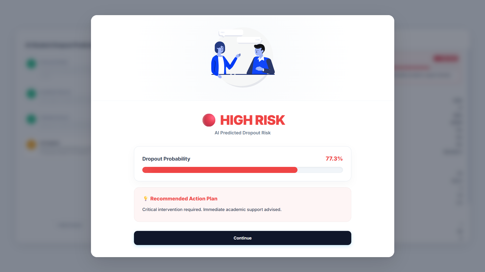
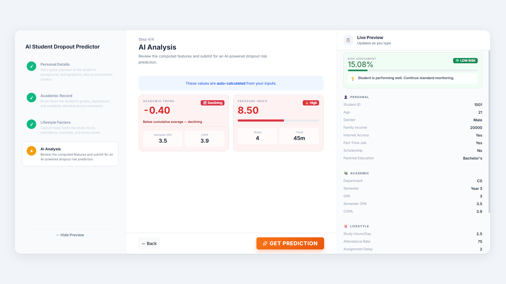
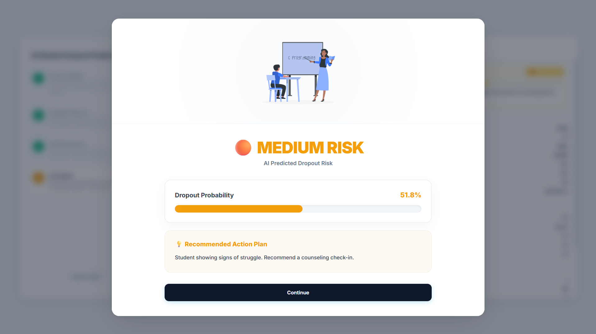

# 🎓 AI Student Dropout Predictor

An intelligent, machine learning-powered web application designed to assess and predict student dropout risks based on academic, lifestyle, and demographic factors. It features a modern, interactive React frontend and a fast API backend.

## 🌟 System Previews

<div align="center">
  
  <br/><br/>
  
  <br/><br/>
  
  <br/><br/>
  
</div>

---

## 🚀 Features

- **Live Risk Assessment:** Real-time percentage predictions and visually distinct risk levels (Low, Medium, High).
- **Dynamic Action Plans:** Actionable, AI-recommended interventions tailored to the student's specific risk category.
- **Premium UI:** Glassmorphism design, Lottie animations, massive beautiful typography, and a multi-step interactive form.
- **Machine Learning API:** Powered by a pre-trained Logistic Regression model served via FastAPI.

---

## 🛠️ Tech Stack

- **Frontend:** React 19, Vite, Bootstrap 5, Lottie-Web, Lucide-React
- **Backend:** Python 3, FastAPI, Uvicorn
- **Machine Learning:** Scikit-Learn, Pandas, Joblib

---

## 💻 Installation & Setup

### 1. Backend Setup (Virtual Environment)
The backend requires Python and several Data Science libraries. It is highly recommended to use a virtual environment (`venv`).

```bash
# 1. Open your terminal in the project root directory

# 2. Create a virtual environment named 'venv'
python -m venv venv

# 3. Activate the virtual environment
# On Windows:
venv\Scripts\activate
# On macOS/Linux:
source venv/bin/activate

# 4. Install the required dependencies
pip install -r requirements.txt
```

### 2. Running the Backend Server
Once the virtual environment is fully activated and dependencies are installed, start the FastAPI server:

```bash
# Navigate to the api directory
cd api

# Run the server
python main.py

# Alternatively, you can run it via uvicorn directly:
# uvicorn main:app --reload --port 8080
```
The API will be available at `http://127.0.0.1:8080`.

---

### 3. Frontend Setup
Open a **new terminal window** (leave the backend server running in the first one).

```bash
# 1. Navigate to the frontend directory
cd frontend

# 2. Install the necessary Node.js modules
npm install

# 3. Start the Vite development server
npm run dev
```
The beautiful frontend will be available at `http://localhost:5173`. 

---

## 📁 Project Structure

- `/frontend` - React application containing all UI components, custom CSS, and public assets (like the Lottie JSON files).
- `/api` - FastAPI Python backend hosting the machine learning models (`.pkl` scaler, encoder, and model) and the `main.py` routing logic.
- `requirements.txt` - Categorized list of required Python dependencies.
